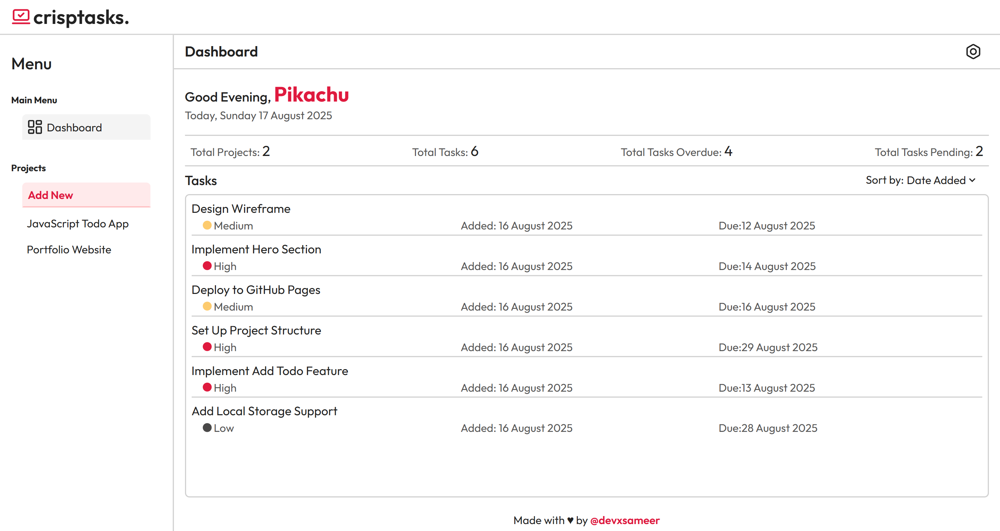
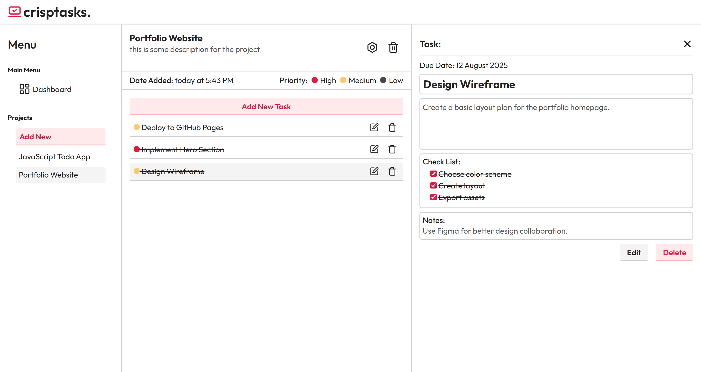
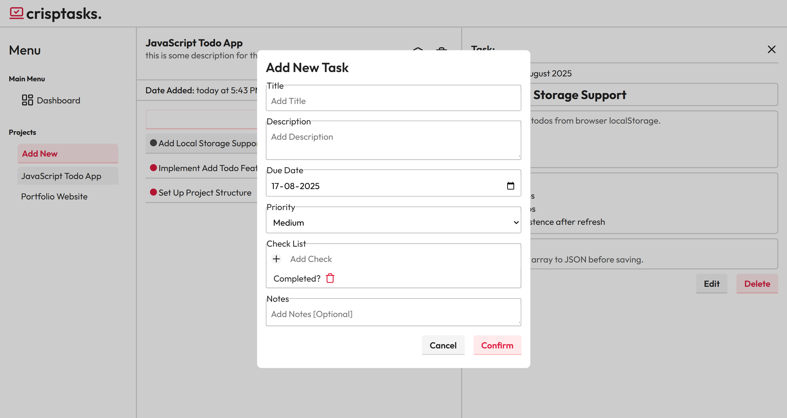
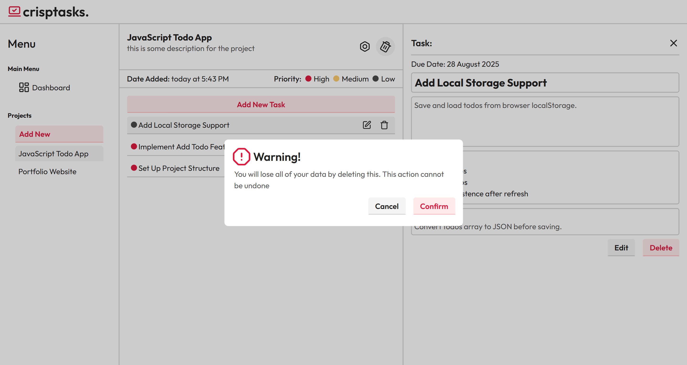

# CrispTasks — Modern To‑Do & Project Manager

crispTasks is a fully featured, responsive to‑do and project management app built with HTML, CSS, and vanilla JavaScript. It uses ES Modules, Webpack, and date‑fns, stores everything in localStorage (including the user’s name), and offers a clean, productivity‑first UI with Lucide icons.

- Live: [https://devxsameer.github.io/crisptasks/](https://devxsameer.github.io/crisptasks/)
- Repo: [https://github.com/devxsameer/crisptasks](https://github.com/devxsameer/crisptasks)

## ✨ Highlights

- Multi‑project support with descriptions.
- Rich task model: title, description, due date, priority, notes, checklist, completed state.
- Persistent data: projects, tasks, checklists, and user name — all in localStorage.
- Dashboard aggregates all tasks across projects with quick stats.
- Sort tasks by priority, date added, due date, or title.
- Edit dialogs and delete confirmations for safe UX.
- ES Modules + Webpack + npm scripts.
- Fully responsive layout (mobile → desktop).
- Lucide icons for a crisp UI.
- date‑fns for robust date formatting and comparisons.

## 🖼️ Screenshots

Add images to the repo and update filenames below.

- Dashboard  
  

- Project page with Task details open  
  

- Add/Edit Task modal  
  

- Delete confirmation dialog  
  

## 🔧 Tech Stack

- HTML5, CSS3, Vanilla JavaScript (ES6+)
- ES Modules
- Webpack + npm scripts
- date‑fns
- Lucide Icons
- LocalStorage API

## 🚀 Getting Started

Follow these steps to set up the project locally:

### 1. Clone the Repository

```bash
git clone https://github.com/devxsameer/crisptasks.git
cd crisptasks
```

### 2. Install

```bash
npm install
```

### 3. Develop

```bash
npm run dev
```

`→ Open the local URL shown in the terminal (commonly http://localhost:8080)`

### 4. Build for production

```bash
npm run build
```

`→ Output in dist/`

## 🧭 Features in Detail

- **Projects**

  - Create, edit, delete projects (title + description)
  - Sidebar navigation for quick switching

- **Tasks**

  - Fields: title, description, due date, priority (High/Medium/Low), notes, checklist, completed
  - Edit and delete with confirmation
  - Priority dots for quick scanning

- **Checklist**

  - Add/remove checklist items per task
  - Persistent completion state in localStorage (survives refresh)

- **Dashboard**

  - Personalized greeting (user name editable and saved)
  - Quick stats: total projects, total tasks, overdue, pending
  - Sorting: priority, date added, due date, title

- **Persistence**

  - All data stored locally — no backend required

- **UX**
  - Accessible dialogs for destructive actions
  - Clean, responsive layout and touch‑friendly controls

## 🧠 What I Learned

- Structuring a modular JS app with ES Modules
- Modeling application state in localStorage (serialization patterns)
- Building scalable UI with reusable components and clean CSS
- Thoughtful UX: confirmations, sorting, priority cues, and checklists
- Setting up and using a modern frontend toolchain with Webpack and npm scripts
- Practical date handling with date‑fns


## 🙌 Credits

- Inspired by The Odin Project (Full Stack JS Path → Todo App)
- Icons: Lucide Icons
- Dates: date‑fns

---

Made with ❤️ by devxsameer. If you like this project, a ⭐ on the repo would be awesome!